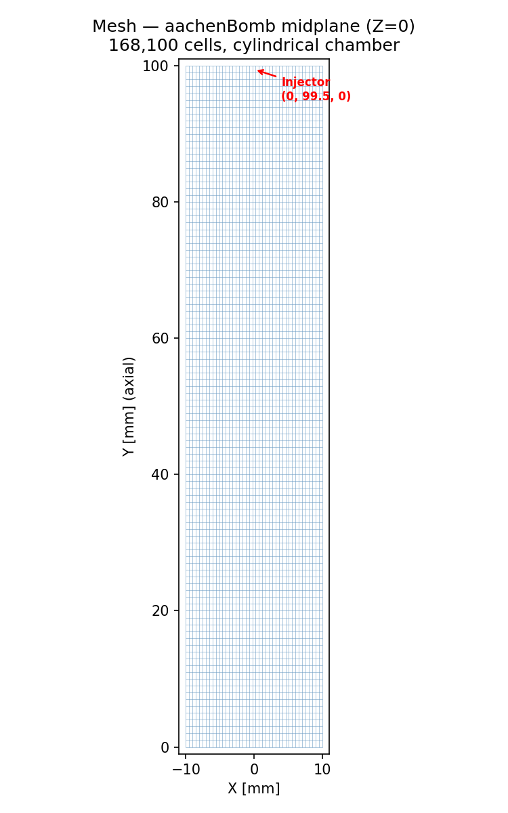
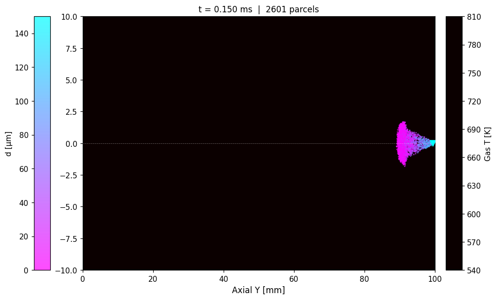
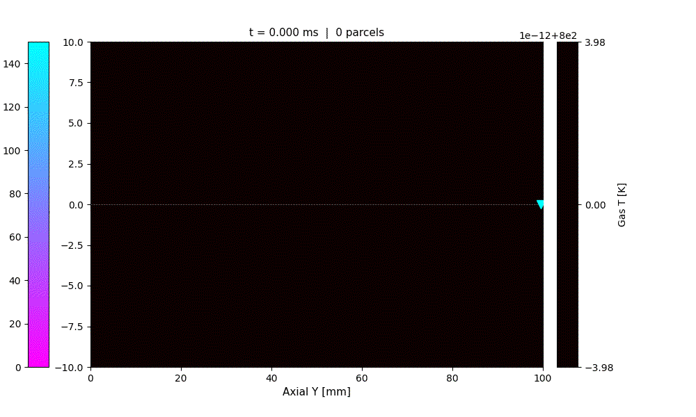
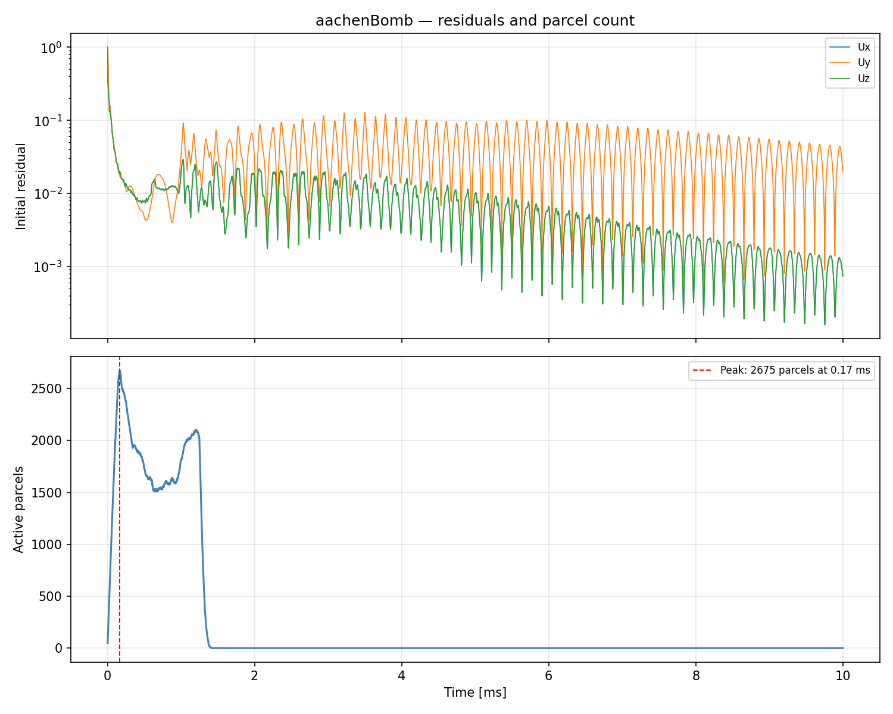

# aachenBomb — OpenFOAM 13 Lagrangian Spray Combustion

Simulation of the Aachen bomb experiment: n-heptane fuel spray injected downward into a
hot pressurised nitrogen/oxygen atmosphere. The spray atomises, evaporates, and ignites,
producing a transient combustion event that is a standard validation case for Lagrangian
spray models.

---

## Physical Setup

| Parameter | Value |
|---|---|
| Chamber geometry | Cylindrical, Ø 20 mm × 100 mm height |
| Initial gas temperature | 800 K |
| Initial pressure | 5 MPa |
| Initial gas composition | O₂ / N₂ (air) |
| Initial gas velocity | Quiescent (0 m/s) |
| Fuel | n-Heptane (C₇H₁₆) liquid |
| Injection SOI | 0 ms |
| Injection duration | 1.25 ms |
| Total injected fuel mass | 6 µg |
| Injector position | (0, 99.5 mm, 0) — top centre |
| Injection direction | Downward (−y) |

---

## Mesh

The chamber is meshed with `blockMesh` as a structured hex-dominant grid. A cylindrical
cross-section is approximated with an O-grid topology.

| Parameter | Value |
|---|---|
| Total cells | 168,100 |
| Cell type | Hexahedral |
| Mesh topology | Structured O-grid |
| Injector location | Top centre (y = 99.5 mm) |

**Midplane mesh (Z = 0) — chamber cross-section with injector location:**


---

## Multiphase Model Setup

The simulation uses a two-way coupled Euler–Lagrange approach: the gas phase is solved on
the fixed Eulerian mesh, and fuel droplets are tracked as Lagrangian parcels that exchange
mass, momentum, and energy with the gas.

### Gas Phase (Eulerian)

| Setting | Value |
|---|---|
| Solver | `multicomponentFluid` |
| Turbulence model | k-ε (kEpsilon) |
| Thermodynamics | JANAF polynomials |
| Transport | Sutherland viscosity law |
| Species mixture | `multicomponentMixture` |
| Species | C₇H₁₆, O₂, N₂, CO₂, H₂O (5 species) |
| Chemistry | Single-step, CHEMKIN format |

**Reaction mechanism (`chemkin/chem.inp`):**

```
C7H16 + 11 O2 → 7 CO2 + 8 H2O
A = 5×10⁸,  β = 0,  Ea = 15,780 cal/mol
[C7H16]^0.25 · [O2]^1.5  (modified reaction orders via FORD)
```

### Spray / Lagrangian Phase

| Setting | Model / Value |
|---|---|
| Cloud type | `sprayCloud` |
| Coupling | Two-way (mass, momentum, energy) |
| Injection model | `coneInjection` |
| Injector type | Disc (solid cone) |
| Nozzle diameter | 190 µm |
| Half-cone angle | 10° |
| Parcel rate | 2×10⁷ parcels/s |
| Flow rate profile | Tabulated (peaks at ~9.5 mL/s at ~0.125 ms) |
| Size distribution | Rosin-Rammler: d = 150 µm, n = 3 |
| Droplet drag | Sphere drag |
| Breakup | ReitzDiwakar (bag + stripping) |
| Heat transfer | Ranz-Marshall (Bird correction enabled) |
| Evaporation | `liquidEvaporationBoil` |
| Wall interaction | Rebound |
| Dispersion | None |
| Surface film | None |

The Rosin-Rammler distribution sets the initial droplet size range from 1 µm to 150 µm
with a characteristic diameter of 150 µm and spread parameter n = 3. The ReitzDiwakar
breakup model applies bag-breakup when We > C_bag and stripping breakup when
We/√Re > C_strip, progressively reducing droplet diameter as parcels travel through
the high-temperature gas.

---

## Boundary Conditions

| Field | Walls |
|---|---|
| U | `noSlip` (zero velocity) |
| T | `zeroGradient` (adiabatic) |
| p | `zeroGradient` |
| Yi (species) | `zeroGradient` |

The chamber is effectively closed: all boundaries are walls with no inlet or outlet
flow. The initial gas state drives the entire thermodynamic event.

---

## Solver Setup

| Setting | Value |
|---|---|
| Solver | `multicomponentFluid` |
| Time step | Fixed, Δt = 2.5 µs |
| End time | 10 ms |
| Write interval | 50 µs (200 output times) |
| Lagrangian sub-stepping | Analytical temperature integration |
| Velocity integration | Euler |
| Source coupling | Explicit, weight = 1 |

The time step is held fixed at 2.5 µs. The tutorial default uses adaptive time-stepping
(`adjustTimeStep yes`) which in practice produces Δt ≈ 0.38 µs — nearly 7× smaller —
requiring ~26,500 solver steps to reach 10 ms. With the fixed step the run completes in
4,000 steps while remaining stable (max Co ≈ 0.05 throughout).

---

## Results

### Spray Evolution and Combustion

**Gas temperature field and droplet cloud at t = 0.15 ms (peak injection):**


This is a side-view (axial–radial) cross-section. The horizontal axis is the axial Y
coordinate (mm) and the vertical axis is radial distance R from the chamber centreline.
The injector sits at Y = 99.5 mm, R = 0 (right edge, centreline), injecting leftward
(−Y direction) with a 10° half-cone angle that opens radially outward. Droplets are
coloured by diameter; gas temperature is shown in the background — at this early time
the gas is still at ~800 K and combustion has not yet started.

**Animation of the full event (0–10 ms):**



The animation shows the spray phase (0–1.25 ms), droplet evaporation and fuel-vapour
mixing (1.25–2 ms), and the combustion event (2–10 ms).

### Key Event Timeline

| Time | Event |
|---|---|
| 0 ms | Injection begins; first parcels enter domain |
| ~0.17 ms | Peak parcel count: 2,675 active parcels |
| 1.25 ms | Injection ends |
| ~1.4 ms | All droplets fully evaporated |
| ~2 ms | Ignition; temperature begins rapid rise |
| ~5 ms | Peak gas temperature: ~3,264 K |
| 10 ms | End of simulation |

### Convergence

**Solver residuals and parcel count vs time:**


The residual plot (top) shows the transient combustion physics — residuals rise sharply
at ignition (~2 ms) as steep temperature and species gradients develop, then decay as
the gas mixture burns out. The parcel count (bottom) tracks injection and evaporation:
parcels accumulate during the 1.25 ms injection window, then disappear rapidly as the
hot gas evaporates the fuel.

### Species and Energy Budget

The single-step mechanism converts all C₇H₁₆ vapour to CO₂ and H₂O. The 6 µg of
injected fuel releases approximately:

```
ΔH_c(C7H16) ≈ 44.6 MJ/kg  →  Q ≈ 6×10⁻⁶ × 44.6×10⁶ ≈ 268 J
```

This energy is deposited into 168,100 cells × ~5×10⁻¹⁰ m³/cell × 5 kg/m³ ≈ 4.2×10⁻⁴ kg
of gas, giving a temperature rise of Q/(m·Cv) ≈ 2,400 K above the 800 K initial state —
consistent with the observed peak of ~3,264 K.

---

## Running the Case

```bash
source /opt/openfoam13/etc/bashrc
cd openfoam-aachenBomb
blockMesh
foamRun
```

Post-processing scripts (Python, requires numpy, matplotlib, scipy, imageio):

```bash
python3 plot_convergence.py          # convergence.png
python3 plot_spray_particles.py      # spray_particles.png
python3 make_spray_animation.py      # spray_animation.gif
```
